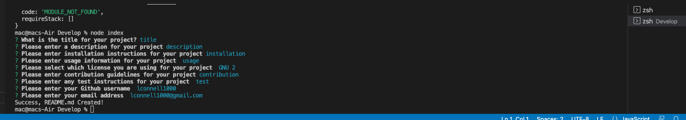

# 09 Node.js Homework: Professional README Generator

## The project

For this project we had to make a Readme generator that would be useful and practical to us in real life. It is our first time using Node.js and I really enjoyed this.

When the user enters command-line application, then they are prompted for information about their application repository and a high quality, profession README.md is generated with all the relevant information such as title, desciption, table of contents, installation, usage, license, contributing, tests and questions. The table of contents is functional upon completion and takes the user to the relevant section of the readme when clicking on them.


## User Story

```md
AS A developer
I WANT a README generator
SO THAT I can quickly create a professional README for a new project
```

## A screenshot of the terminal line


The following image shows the terminal line prompts while in use:



## A link to a video walk through of the demo

This link shows a video of the ReadMe Generator in action: https://watch.screencastify.com/v/B5oqqDN0gDdrcJrMp27j